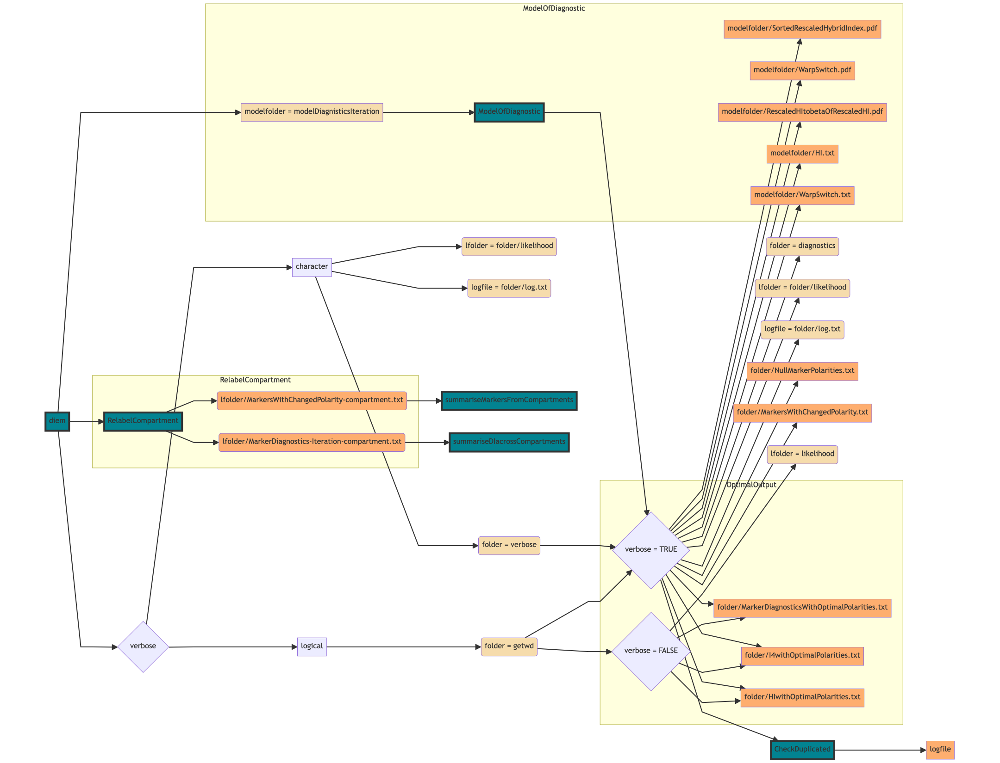

```{r, include = FALSE}
knitr::opts_chunk$set(
  collapse = TRUE,
  comment = "#"
)
```

Genome polarisation [@Baird2023] uses the *diem* algorithm to estimate which allele of a single nucleotide polymorphic marker belongs to which side of a barrier to gene flow based on whole-genome associations. The key result is then the **marker polarity** (whether to read the marker as in the *diem* input file or whether to flip the homozygous state labels 0&harr;2), **marker diagnostic index** (how relevant the marker is with respect to the barrier to gene flow), and **marker polarity support** (how certain we are regarding whether to flip the state labels or not). 

This information is stored in a file *MarkerDiagnosticsWithOptimalPolarities.txt* with columns Marker, newPolarity, DI, and Support. However, the `diem` function generates other outputs, which help to control the genome polarisation analyses and to interpret the results. Some of this information is identical to the function return value. The documentation for the return values can be found by running `?diem`. This vignette explains the outputs saved to files.


# Obligatory outputs {#defaults}

Three output files will be saved to the working directory or to the path specified in the `verbose` argument. Those are:

* MarkerDiagnosticsWitOptimalPolarities.txt,
* HIwithOptimalPolarities.txt, and
* I4withOptimalPolarities.txt.


## MarkerDiagnosticsWithOptimalPolarities {#markerDiagnostics}

The *MarkerDiagnosticsWithOptimalPolarities.txt* is a tab-delimited table with four columns and the number of rows equal to the number of markers across all compartments used to run genome polarisation with `diem`. This is the key results file identifying the marker relevance with respect to the detected barrier to gene flow.

The first column **Marker** is an index of the marker that is successive in the files as they are ordered in the `files` argument in the `diem` call. The value in the Marker column will correspond to the respective index in the file ending with *includedSites.txt* if the input files were generated by the `vcf2diem` function.

The second column **newPolarity** contains TRUE/FALSE values, specifying which allele in the specific marker belongs to which side of the barrier. When the value is `FALSE`, encoded as 0 in Eq. 22 [@Baird2023], the allele encoded as 0 in its homozygous state in the input file belongs to the barrier side associated with low values of hybrid index of the individuals. When the newPolarity value for a marker is `TRUE`, the homozygous states need to be flipped 0&harr;2 to correctly associate with the barrier sides. In terms of interpretation, this means that the allele encoded as 2 in its homozygous state is associated with low values of the hybrid index [sic!]. Which specific alleles these are for any marker can be found in the *includedSites.txt* file from the `vcf2diem`.

The third column **DI** is numeric with values of the diagnostic index of the markers as specified in Eq. 20 [@Baird2023]. The diagnostic index is a log likelihood, so its values are always negative. Polarised markers with high diagnostic index characterize the barrier to gene flow. Such markers will tend to be fixed for one allele on either side of the barrier. Conversely, markers with low diagnostic index will have signal orthogonal to the detected barrier to gene flow. They could reflect ancestral genetic variation, standing variation not contributing to the barrier to gene flow, or artifacts such as overmerging of repeated motifs onto the reference.

The fourth column **Support** is numeric and the values represent polarity support for the markers as given in Eq. 21 [@Baird2023]. The support is the gain in likelihood when the correct marker 0&harr;2 'flipping' is compared to its reverse. High marker support gives confidence that the marker polarity reflects the detected barrier to gene flow. In general, markers with high diagnostic index tend to also have high support. 


## HIwithOptimalPolarities {#HI}

The *HIwithOptimalPolarities.txt* is a tab-delimited one-column matrix of individual hybrid indices with row names corresponding to the individual indices. Note that the hybrid indices are calculated from the polarised genotypes for all individuals found in the input files, not only those specified in the `ChosenInds` argument of the `diem` function. The hybrid indices are calculated as genome admixture from summaries of polarised genotypes as in Eq. 7 [@Baird2023]. 

> <span style="color:red">CAUTION:</span>These hybrid indices are calculated *without taking into account the diagnosticity of markers*! As such they may not show barrier signal well at all. Hybrid indices and genome polarisation diagrams should be calculated and plotted after the user decides on a diagnostic index threshold. The ideal threshold will be specific to your dataset. Check `vignette("diemr-diagnostic-index-expecation-maximisation-in-r")` for guidelines how to calculate it.
 
If you choose to ignore this warning and include all markers when calculating hybrid indices you will find the range of hybrid indices is small, and centred on 0.5. This is because most genome sites are close to invariant, and so `diem` will flip homozygous state labels 0&harr;2 at random. A purely random answer will give hybrid index equal to 0.5. You can rescale hybrid indices with a large random influence using Eq. 11 [@Baird2023], so they lie on the interval $[0,1]$.


## I4withOptimalPolarities {#I4}

The *I4withOptimalPolarities.txt* file contains genome-wide summaries of genomic states for all input genomes (Eq. 4 in [@Baird2023]). It is a tab-delimited table with four columns representing the unknown state (column name "_") that cannot be encoded as a genotype in terms of the two most frequent alleles, the second column representing homozygote encoding 0, the third column heterozygote encoding 1 and the fourth column homozygote encoding 2. The rows are all individuals in the input files, with row names corresponding to indices. 

The 4-genomic state counts can be used to calculate the hybrid index, observed heterozygosity and error rate for all individuals. The equations 7, 9, and 10 [@Baird2023] are implemented in the function `pHetErrOnStateCount` that can be applied to the rows of the I4withOptimalPolarities. 

However, note that the ${}^4\mathbf{I}$ in the output was calculated from all markers (see [CAUTION](#HI) in the previous section). We advice the users to preferentially filter their markers based on their diagnosticity after the `diem` analysis and recalculate the [hybrid indices](#HI) and the [${}^4\mathbf{I}$](#I4) from the filtered, polarised genotypes.


 
# Optional outputs

The `diem` function can output additional files useful for tracking algorithm convergence during iterations and ensuring repeatable initialisation of genome polarisation. The flowchart in [Figure 1](#fig1) specifies what processes generate the files and how the user controls what files will be stored and where.

<div id = "fig1">
```{r, echo = FALSE, fig.align = 'center', out.width = '100%', fig.cap = '**Figure 1**. Flowchart of how to control output files and their location in `diem`. Green -- functions generating or using the files. Except `diem` all functions are internal. Beige, grey -- variable values set by the user (grey) or by internal processes (beige). Orange -- stored output files. Yellow rectangles -- main processes generating files.'}

```
</div>

### The user perspective

The `verbose` argument in the `diem` function controls the stored output files. The default value `verbose = FALSE` writes three [key output files](#defaults) in the current working directory ([Figure 1](#fig1)). To locate the files, the current working directory can be found with:
```{r, eval = FALSE}
getwd()
```

Additionally, the `verbose` argument can trigger a verbose output in two ways. 

1. When `verbose` contains a character string with a path to a specific folder, the verbose output will be stored in that location.
2. When `verbose = TRUE`, the verbose output will be stored in the current working directory.


## NullMarkerPolarities

The optimal approach to genome polarisation with `diem` is to strip all possible data cues before the analysis. In this way, if `diem` finds a barrier you can be certain it is an intrinsic property of the data. Using random initial marker polarities is central to this approach. We recommend setting the `diem` argument `markerPolarity = FALSE`. The function then generates random polarities for the initiation of the algorithm iterations. 

This initial state for `diem` is saved in file *NullMarkerPolarities.txt*. It is a text file the first line describing the contents of the file. The following lines show space-separated TRUE or FALSE values, where each row corresponds to a compartment as they were specified in the `files` argument in `diem`. Because `diem` is a deterministic algorithm, if you start it from the same initial state, you will get precisely the same answer. You can test this by setting `markerPolarity` to be the list from *NullMarkerPolarities*. 

```{r, eval = FALSE}
nullPolarities <- readLines("folder/NullMarkerPolarities.txt")[-1]
nullPolarities <- lapply(
    strsplit(nullPolarities, split = " "),
    as.logical
)
diem(..., markerPolarities = nullPolarities)
```

You can also test the convergence of the algorithm from different initial states by running the same analysis, but each time generating a new random null by setting `markerPolarities = FALSE`.


## MarkersWithChangedPolarities {#changedPolarities}

The file *MarkersWithChangedPolarities.txt* is a tab-delimited file with three columns and a variable number of rows. The column **changedMarkers** shows indices of markers across all compartments for which the polarity was changed in the given iteration compared to the marker polarity in the previous iteration. The column **time** gives a time stamp of when the changes were recorded. The column **iteration** specifies the iteration of the algorithm. 

Note that here, markers are pooled across all compartments. The information is useful in tracking convergence in postprocessing, and so is not of interest to the casual user. During the analysis run, keeping the information about polarity changes separate for each compartment is computationally more tractable, especially in parallel processing. A set of files specifying the information for each compartment is stored in a *likelihood* folder ([Figure 1](#fig1)).


### MarkersWithChangedPolarities-(compartmentNumber)

The contents of the files is analogical as in the [*MarkersWithChangedPolarities.txt*](#changedPolarities). The difference being that the marker indices are sequential for each compartment. 

### MarkerDiagnostics(iteration)-(compartmentNumber)

The contents of the files correspond to the contents of the [*MarkerDiagnosticsWithOptimalPolarities.txt*](#markerDiagnostics). Here, the polarities, diagnostic indices and their supports are reported separately for each iteration and for each compartment.

Both sets of compartment-specific temporary files are initially stored regardless of the value in the `verbose` argument, as they are used internally during the analysis. When `verbose = FALSE`, `diem` attempts to delete the *likelihood* folder on exit.


## Iteration-specific graphics

The internal `ModelOfDiagnostic` function implements Eq. 19 [@Baird2023] that is the powerful tool to detect the most prominent barrier to gene flow in the data. Seeing how individuals become separated on either side of the barrier provides insights into the algorithm convergence.

### WarpSwitch files

The *WarpSwitch.pdf* files plot differences in sorted rescaled hybrid indices (Eq. 12) used to identify the barrier to gene flow [@Baird2023]. The *WarpSwitch.txt* files then describe what genomic states the ideal diagnostic marker would have for all included individuals (Eq. 13), and how the ideal 4-genomic state count matrix (Eq. 14) would look like for the first ten individuals. 

### Hybrid index files

The *SortedRescaledHybridIndex.pdf* shows how the differences in hybrid indices between individuals belonging to either side of the barrier become more pronounced with progressing iterations. Note that in order to identify which individuals are placed where, one needs to replicate the figure from [hybrid index](#HI) values in files *HI.txt*.

The files *RescaledHItobetaOfRescaledHI.pdf* show the weight for the hybrid index (Eq. 15) that together with the parameter value in the `diem` argument `epsilon` will inform on how much emphasis the analysis puts on the ideal state with the center of the barrier identified in the WarpSwich files.

The visualisation in the iteration-specific graphics provide a tangible track record of how the theoretical ideals of pure individuals and perfectly diagnostic markers contribute to informing on a barrier to gene flow in a realistic scenario, where there are no pure individuals and no perfectly diagnostic markers. 


## The log file

The *log.txt* file provides a human-readable overview of the `diem` iterations. During initialisation stage, the log file will list the number of (chosen) markers and (chosen) individuals in the analysis run, followed by the top seven rows of the [4-genomic state count matrix ${}^4\mathbf{I}$](#I4) with null polarisation, correction for small data (Eq. 5), top seven rows of the ${}^4\mathbf{A}$, which is the ${}^4\mathbf{I}$ matrix corrected for compartment- and individual-specific ploidies and is used to calculate the hybrid index, the top seven rows of the weighted ${}^4\mathbf{V}$ matrix (Eq. 16), and the respective log-likelihood values (Eq. 19).

For subsequent iterations, the log file also quantifies how many markers switch polarities between iterations, and shows the corresponding change to the ${}^4\mathbf{I}$.


# References